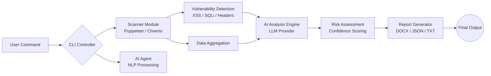

<div align="center">
  

  <h3 align="center">AI-Powered Web Application Security Testing CLI</h3>

  <br />

  [](https://www.npmjs.com/package/kramscan)
  [](https://www.npmjs.com/package/kramscan)
  [](https://github.com/shaikhakramshakil/kramscan/blob/main/LICENSE)
  [](https://github.com/shaikhakramshakil/kramscan)
  [](https://www.typescriptlang.org)
  [](https://nodejs.org)

  <br />

  🔬 **A next-generation security auditing tool that combines automated vulnerability scanning with multi-provider AI analysis.**

  *Empowering developers and security researchers with institutional-grade insights and an interactive AI agent.*

  <br />

  [🌐 NPM Package](https://www.npmjs.com/package/kramscan) · [📖 Documentation](#-usage) · [🐞 Report Bug](https://github.com/shaikhakramshakil/kramscan/issues)

</div>

---

<br />

## 🚀 The Problem We Solve
Web security is complex and often fragmented. Developers rely on multiple disjointed tools for scanning, manual testing, and reporting. Traditional automated scanners generate noise without context, and manual pentesting is time-consuming and expensive.

**KramScan bridges this gap.** We provide a unified command-line interface that orchestrates headless browser scanning, scrapes critical security headers, and leverages **Generative AI** (OpenAI, Gemini, Anthropic) to analyze findings. It delivers actionable, human-readable insights alongside raw vulnerability data—all in seconds.

<br />

---

<br />

## ✨ Key Features
| Feature | Description |
| :--- | :--- |
| 🔍 **Automated Vulnerability Engine** | Detects XSS, SQL Injection, CSRF, and insecure headers using Puppeteer-powered crawling. |
| 🤖 **Interactive AI Agent** | A conversational security assistant that understands natural language commands like "scan example.com". |
| 🧠 **Multi-Provider AI Analysis** | Supports OpenAI, Anthropic, Google Gemini, Mistral, OpenRouter, and Kimi (Moonshot). |
| 📄 **Professional Reporting** | Generates detailed DOCX, TXT, and JSON reports with executive summaries and remediation steps. |
| 🌐 **Headless Browser Testing** | Renders modern SPAs (Single Page Applications) to find vulnerabilities in dynamic content. |
| ⚡ **CLI-First Architecture** | Optimized for speed, scriptability, and seamless integration into CI/CD pipelines. |

<br />

---

<br />

## 🏗️ Architecture & Workflow



<br />

---

<br />

## 🧪 Tech Stack
<div align="center">

| Component | Technology |
| :--- | :--- |
| **Runtime** | Node.js ≥ 18 |
| **Language** | TypeScript 5.4 |
| **CLI Framework** | Commander.js, Inquirer.js |
| **Browser Automation** | Puppeteer (Headless Chrome) |
| **AI Integration** | OpenAI SDK, Google Generative AI, Anthropic SDK |
| **Reporting** | Docx, Chalk|
| **Package Manager** | NPM / Yarn / PNPM |

</div>

<br />

---

<br />

## 🧠 Supported AI Providers

| Provider | SDK / Integration | Default Model |
| :--- | :--- | :--- |
| **OpenAI** | `openai` | `gpt-4` |
| **Anthropic** | `@anthropic-ai/sdk` | `claude-3-5-sonnet-20241022` |
| **Google Gemini** | `@google/generative-ai` | `gemini-2.0-flash-exp` |
| **Mistral** | `@mistralai/mistralai` | `mistral-large-latest` |
| **OpenRouter** | OpenAI-compatible | `anthropic/claude-3.5-sonnet` |
| **Kimi** | OpenAI-compatible | `moonshot-v1-8k` |

> Switch providers instantly with `kramscan onboard` or by editing `~/.kramscan/config.json`.

<br />

---

<br />

## 🚀 Quick Start

### 1. Installation
Install KramScan globally using npm:

```bash
npm install -g kramscan
```

### 2. First-Time Setup
Initialize the configuration wizard to set up your AI provider and API keys:

```bash
kramscan onboard
```

### 3. Run a Scan
Execute a full security scan on a target URL:

```bash
kramscan scan https://example.com
```

<br />

---

<br />

## 📖 Usage & Commands

| Command | Description | Status |
| :--- | :--- | :---: |
| `kramscan` | Launch the interactive dashboard menu. | ✅ Stable |
| `kramscan scan <url>` | Run a comprehensive vulnerability scan. | ✅ Stable |
| `kramscan agent` | Start the conversational AI security assistant. | ✅ Stable |
| `kramscan analyze` | Analyze previous scan results using the configured AI. | ✅ Stable |
| `kramscan report` | Generate a professional report from scan data. | ✅ Stable |
| `kramscan onboard` | Run the configuration and setup wizard. | ✅ Stable |
| `kramscan doctor` | Verify environment health and dependencies. | ✅ Stable |
| `kramscan config` | View and edit current configuration settings. | ✅ Stable |

<br />

### Example Agent Session
```bash
$ kramscan agent
> scan https://example.com

Agent: I'll perform a comprehensive security scan of https://example.com.
       Checking for XSS, SQLi, and missing headers...
       [Scanning...]
       
Agent: Scan complete! Found 2 High severity issues.
       Would you like me to generate a report?
```

<br />

---

<br />

## 🗺️ Roadmap

- [x] Core vulnerability scanner (XSS, SQLi, CSRF, headers)
- [x] Multi-provider AI analysis engine
- [x] Interactive AI agent mode
- [x] Professional report generation (DOCX, TXT, JSON)
- [x] Configuration wizard & management
- [ ] Plugin system for custom scan modules
- [ ] CI/CD integration (GitHub Actions, GitLab CI)
- [ ] PDF report generation
- [ ] Web-based dashboard UI

<br />

---

<br />

## 🔒 Security & Privacy
- **Local Execution:** All scanning logic runs locally on your machine.
- **API Key Safety:** AI provider API keys are stored securely in your local home directory and are never sent to our servers.
- **Data Privacy:** Scan data is sent only to your chosen AI provider for analysis and is not stored by KramScan.

<br />

---

<br />

## 👤 Author
<div align="center">

**Akram Shaikh**

[](https://akramshaikh.me)
[](https://github.com/shaikhakramshakil)
[](https://www.linkedin.com/in/shaikhakramshakil/)

</div>

<br />

---

<br />

## 📄 License
This project is licensed under the **MIT License** — see the [LICENSE](LICENSE) file for details.

<div align="center">
  <sub>Made with ❤️ by Akram Shaikh</sub>
</div>
