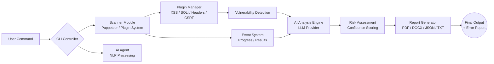

<div align="center">
  

  <h3 align="center">AI-Powered Web Application Security Testing CLI</h3>

  <br />

  [](https://www.npmjs.com/package/kramscan)
  [](https://www.npmjs.com/package/kramscan)
  [](https://github.com/shaikhakramshakil/kramscan/blob/main/LICENSE)
  [](https://github.com/shaikhakramshakil/kramscan)
  [](https://www.typescriptlang.org)
  [](https://nodejs.org)

  <br />

  🔬 **A next-generation security auditing tool that combines automated vulnerability scanning with multi-provider AI analysis.**

  *Empowering developers and security researchers with institutional-grade insights, modular plugin architecture, and an interactive AI agent.*

  <br />

  [🌐 NPM Package](https://www.npmjs.com/package/kramscan) · [📖 Documentation](#-usage) · [🐞 Report Bug](https://github.com/shaikhakramshakil/kramscan/issues)

</div>

---

<br />

## 🚀 The Problem We Solve
Web security is complex and often fragmented. Developers rely on multiple disjointed tools for scanning, manual testing, and reporting. Traditional automated scanners generate noise without context, and manual pentesting is time-consuming and expensive.

**KramScan bridges this gap.** We provide a unified command-line interface that orchestrates headless browser scanning, scrapes critical security headers, leverages **Generative AI** (OpenAI, Gemini, Anthropic) for analysis, and features a **modular plugin system** for extensibility. It delivers actionable, human-readable insights alongside raw vulnerability data—all in seconds.

<br />

---

<br />

## ✨ Key Features
| Feature | Description |
| :--- | :--- |
| 🔍 **Automated Vulnerability Engine** | Detects XSS, SQL Injection, CSRF, insecure headers, CORS misconfigs, open redirects, and more. |
| 🔌 **10 Built-in Security Plugins** | CORS, debug endpoints, directory traversal, cookie auditing, open redirects, sensitive data, and more. |
| 🛠️ **Dev Mode (Watch Scanner)** | Watch your localhost for file changes and auto re-scan with diff reports (new vs resolved vulns). |
| 🚧 **CI/CD Security Gate** | `kramscan gate` exits with code 1 if vulnerabilities exceed your threshold. Plug into any pipeline. |
| 🤖 **Interactive AI Agent** | A conversational security assistant with **Autonomous Verification** skills to confirm findings live. |
| 🧠 **Multi-Provider AI Analysis** | Supports OpenAI, Anthropic, Google Gemini, Mistral, OpenRouter, and more for results auditing. |
| 📝 **AI Executive Summaries** | Automatically generates business-oriented summaries for Word, JSON, and TXT reports. |
| 📊 **Event-Driven Feedback** | Real-time progress updates with dynamic spinners and live vulnerability alerts during scanning. |
| 📄 **Professional Reporting** | Generates detailed PDF, DOCX, TXT, and JSON reports with remediation steps and error tracking. |
| 🌐 **Headless Browser Testing** | Renders modern SPAs (Single Page Applications) to find vulnerabilities in dynamic content. |
| ⚡ **Smarter User Flow** | Interactive menu and post-scan "Golden Path" prompts for a guided experience. |
| 🛡️ **Error Resilience** | Robust configuration defaults and graceful recovery if individual URLs or plugins fail. |

<br />

---

<br />

## 🏗️ Architecture & Workflow


```mermaid
graph LR
    A[User Command] --> B{CLI Controller};
    B --> C[Scanner Module<br/>Puppeteer / Plugin System];
    B --> D[AI Agent<br/>NLP Processing];
    
    C --> E[Plugin Manager<br/>XSS / SQLi / Headers / CSRF];
    E --> F[Vulnerability Detection];
    C --> G[Event System<br/>Progress / Results];
    
    F & G --> H[AI Analysis Engine<br/>LLM Provider];
    
    H --> I[Risk Assessment<br/>Confidence Scoring];
    I --> J[Report Generator<br/>PDF / DOCX / JSON / TXT];
    J --> K((Final Output<br/>+ Error Report));
```

<br />

### Plugin Architecture

KramScan is built on a modular plugin system that makes extending vulnerability detection effortless:

```
src/plugins/
├── types.ts                        # Base interfaces and types
├── PluginManager.ts                # Plugin orchestration
├── index.ts                        # Plugin exports
└── vulnerabilities/                # Built-in plugins
    ├── XSSPlugin.ts                # Cross-Site Scripting
    ├── SQLInjectionPlugin.ts       # SQL Injection
    ├── SecurityHeadersPlugin.ts    # Missing security headers
    ├── SensitiveDataPlugin.ts      # Exposed secrets & API keys
    ├── CSRFPlugin.ts               # Cross-Site Request Forgery
    ├── CORSAnalyzerPlugin.ts       # CORS misconfiguration
    ├── DebugEndpointPlugin.ts      # Exposed debug/dev endpoints
    ├── DirectoryTraversalPlugin.ts # Path traversal / LFI
    ├── CookieSecurityPlugin.ts     # Insecure cookie flags
    └── OpenRedirectPlugin.ts       # Open redirect detection
```

**Creating a custom plugin:**

```typescript
import { BaseVulnerabilityPlugin, PluginContext } from 'kramscan/plugins';

export class MyCustomPlugin extends BaseVulnerabilityPlugin {
  readonly name = "Custom Detector";
  readonly type = "custom";
  readonly description = "Detects custom vulnerability";
  
  async testParameter(context: PluginContext, param: string, value: string) {
    // Your detection logic here
    if (/* vulnerability found */) {
      return this.success(this.createVulnerability(
        "Custom Vulnerability",
        "Description...",
        context.url,
        "high",
        "Evidence...",
        "Remediation..."
      ));
    }
    return this.failure();
  }
}
```

<br />

---

<br />

## 🧪 Tech Stack
<div align="center">

| Component | Technology |
| :--- | :--- |
| **Runtime** | Node.js ≥ 18 |
| **Language** | TypeScript 5.4 |
| **CLI Framework** | Commander.js, Inquirer.js |
| **Browser Automation** | Puppeteer (Headless Chrome) |
| **AI Integration** | OpenAI SDK, Google Generative AI, Anthropic SDK |
| **Schema Validation** | Zod |
| **Reporting** | Docx, Puppeteer (PDF), Chalk |
| **Package Manager** | NPM / Yarn / PNPM |

</div>

<br />

---

<br />

## 🧠 Supported AI Providers

| Provider | SDK / Integration | Default Model |
| :--- | :--- | :--- |
| **OpenAI** | `openai` | `gpt-4` |
| **Anthropic** | `@anthropic-ai/sdk` | `claude-3-5-sonnet-20241022` |
| **Google Gemini** | `@google/generative-ai` | `gemini-2.0-flash` |
| **Mistral** | `@mistralai/mistralai` | `mistral-large-latest` |
| **OpenRouter** | OpenAI-compatible | `anthropic/claude-3.5-sonnet` |
| **Kimi** | OpenAI-compatible | `moonshot-v1-8k` |
| **Groq** | OpenAI-compatible | `llama-3.1-8b-instant` |

> Switch providers instantly with `kramscan onboard` or by editing `~/.kramscan/config.json`.

### API Key Environment Variables
You can provide API keys via environment variables (useful for CI/CD) instead of saving them locally:

| Provider | Env Var |
| :--- | :--- |
| OpenAI | `OPENAI_API_KEY` |
| Anthropic | `ANTHROPIC_API_KEY` |
| Gemini | `GEMINI_API_KEY` |
| Mistral | `MISTRAL_API_KEY` |
| OpenRouter | `OPENROUTER_API_KEY` |
| Kimi | `KIMI_API_KEY` |
| Groq | `GROQ_API_KEY` |

### Smart Environment Detection
KramScan automatically detects API keys in your environment variables. During `kramscan onboard`, the tool will identify and pre-configure providers like OpenAI, Anthropic, and Gemini if their keys are found in your session.

### AI-Powered Context-Aware Payloads
The scanning engine utilizes AI to generate payloads tailored to the specific context of your application, significantly increasing detection rates against filtered inputs and complex WAFs.

### Autonomous Finding Verification
The `kramscan agent` independently verifies reported vulnerabilities using non-destructive, context-aware payloads to differentiate between theoretical findings and exploitable risks.

<br />

---

<br />

## 🚀 Quick Start

### 1. Installation
Install KramScan globally using npm:

```bash
npm install -g kramscan
```

### 2. First-Time Setup
Initialize the configuration wizard to set up your AI provider and API keys:

```bash
kramscan onboard
```

### 3. Run a Scan
Execute a full security scan on a target URL:

```bash
kramscan scan https://example.com
```

<br />

---

<br />

## 📖 Usage & Commands

| Command | Description |
| :--- | :--- |
| `kramscan` | Launch the interactive dashboard menu with smart argument prompting. |
| `kramscan scan <url>` | Run a comprehensive vulnerability scan with post-scan prompts. |
| `kramscan dev [url]` | Watch-mode localhost scanner with diff reports and desktop notifications. |
| `kramscan gate <url>` | CI/CD security quality gate — exits with code 1 on threshold breach. |
| `kramscan agent` | Start the AI security assistant with autonomous verification skills. |
| `kramscan analyze` | AI-powered analysis with proactive onboarding redirection. |
| `kramscan report` | Generate professional reports with optional AI executive summaries. |
| `kramscan onboard` | Smart setup wizard with environment key detection. |
| `kramscan doctor` | Verify environment health and check for Docker dependencies. |
| `kramscan config` | View and edit current configuration with robust schema defaults. |
| `kramscan scans` | List and inspect recent scans from the persistent index. |
| `kramscan ai` | AI helpers (model listing and connectivity test). |

<br />

### 🛠️ Dev Mode — Localhost Watch Scanner

Scan your local dev server continuously. KramScan watches for file changes and **auto re-scans**, showing a diff of new vs. resolved vulnerabilities:

```bash
# Watch-mode with port shorthand
kramscan dev --port 3000

# Full URL with notifications
kramscan dev http://localhost:3000 --watch-dir ./src --notify

# Single scan (no watching)
kramscan dev http://localhost:8080 --no-watch --fail-on high
```

**How it works:**
1. Probes your server until it's ready (auto-detects Express, Next.js, Django, etc.)
2. Runs an initial security scan
3. Watches `--watch-dir` for file changes (debounced)
4. Re-scans and shows only **new** and **resolved** vulnerabilities

### 🚧 CI/CD Security Gate

Block deployments with vulnerabilities above your threshold:

```bash
# Fail if any high+ vulnerabilities found
kramscan gate http://localhost:3000 --fail-on high

# JSON output for pipeline processing
kramscan gate $APP_URL --fail-on medium --json

# Allow up to 3 low-severity findings
kramscan gate http://staging.example.com --fail-on low --max-vulns 3
```

**Pipeline example (GitHub Actions):**
```yaml
- name: Security Gate
  run: npx kramscan gate http://localhost:3000 --fail-on high
```

<br />

### Scan Profiles and Limits
KramScan supports profiles for quick tuning:

```bash
kramscan scan https://example.com --profile quick
kramscan scan https://example.com --profile balanced
kramscan scan https://example.com --profile deep
```

You can also control crawl limits and URL scope:

```bash
kramscan scan https://example.com --max-pages 30 --max-links-per-page 50
kramscan scan https://example.com --exclude "logout|signout"
kramscan scan https://example.com --include "^https://example\.com/docs"
```

### Automatic PDF Report After Scan
After each scan, KramScan automatically generates a PDF report (no separate command required).

The file is saved to:

- JSON: `~/.kramscan/scans/scan-<timestamp>.json`
- PDF: `~/.kramscan/reports/scanreport_<hostname>_<timestamp>.pdf`

You can disable it with:

```bash
kramscan scan https://example.com --no-pdf
```

### Error Tracking and Recovery
KramScan features comprehensive error handling:

- **Continue on Failure**: Scan continues even if individual URLs fail to load
- **Plugin Error Isolation**: If one vulnerability plugin fails, others continue working
- **Error Reports**: PDF reports include a "⚠️ Scan Errors & Skipped Items" section
- **CLI Feedback**: Real-time error messages during scanning

### Event-Driven Progress Feedback
Watch your scan progress in real-time:

```
🔍 Starting Security Scan
──────────────────────────────────────────────────

✔ Initializing scanner...
⠴ Crawling: https://example.com (5/30)
⚠️ Found high vulnerability: Reflected Cross-Site Scripting (XSS)
⠴ Continuing scan (1 vulns found)...
⠴ Testing forms on https://example.com/login (3 forms)...
✔ Scan complete!
```

### Scan History
Every scan is indexed in `~/.kramscan/scans/index.json`.

```bash
kramscan scans list -n 10
kramscan scans latest
```

### AI Diagnostics
List models and test your configured provider/model:

```bash
kramscan ai models -n 10
kramscan ai test
```

### Example Agent Session
```bash
$ kramscan agent
> scan https://example.com

Agent: I'll perform a comprehensive security scan of https://example.com.
       Checking for XSS, SQLi, and missing headers...
       [Scanning...]
       
Agent: Scan complete! Found 2 High severity issues.
       Would you like me to generate a report?
```

<br />

---


## 🔒 Security & Privacy
- **Local Execution:** All scanning logic runs locally on your machine.
- **API Key Safety:** AI provider API keys are stored securely in your local home directory and are never sent to our servers.
- **Data Privacy:** Scan data is sent only to your chosen AI provider for analysis and is not stored by KramScan.
- **Error Tracking:** Failed scan attempts are logged locally for debugging but never transmitted.

<br />

---

<br />

## 👤 Author
<div align="center">

**Akram Shaikh**

[](https://akramshaikh.me)
[](https://github.com/shaikhakramshakil)
[](https://www.linkedin.com/in/shaikhakramshakil/)

</div>

<br />

---

<br />

## 📄 License
This project is licensed under the **MIT License** — see the [LICENSE](LICENSE) file for details.

<div align="center">
  <sub>Made with ❤️ by Akram Shaikh</sub>
</div>
