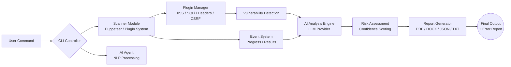

<div align="center">
  

  <h3 align="center">AI-Powered Web Application Security Testing CLI</h3>

  [](https://github.com/shaikhakramshakil/kramscan/actions)
  [](https://www.npmjs.com/package/kramscan)
  [](https://www.npmjs.com/package/kramscan)
  [](https://github.com/shaikhakramshakil/kramscan/blob/main/LICENSE)
  [](https://www.typescriptlang.org)
  [](https://nodejs.org)

</div>

---

KramScan is a command-line security auditing tool that combines automated vulnerability scanning with multi-provider AI analysis. It orchestrates headless browser crawling, runs a modular plugin system against discovered pages, and passes findings through a generative AI layer (OpenAI, Gemini, Anthropic, and others) to produce actionable, context-aware reports.

[NPM Package](https://www.npmjs.com/package/kramscan) · [Documentation](#usage--commands) · [Report Bug](https://github.com/shaikhakramshakil/kramscan/issues) · [Request Feature](https://github.com/shaikhakramshakil/kramscan/issues)

---

## Features

- **Automated vulnerability detection** — XSS, SQL injection, CSRF, insecure headers, CORS misconfigurations, open redirects, and more.
- **10 built-in security plugins** — CORS, debug endpoints, directory traversal, cookie auditing, open redirects, sensitive data exposure, and others. Easily extensible.
- **Dev mode (watch scanner)** — Watches your localhost for file changes and auto re-scans, showing a diff of new vs. resolved findings.
- **CI/CD security gate** — `kramscan gate` exits with code 1 when vulnerabilities exceed a configurable threshold.
- **Interactive AI agent** — Conversational security assistant with autonomous verification capabilities to confirm findings live.
- **Multi-provider AI analysis** — Supports OpenAI, Anthropic, Google Gemini, Mistral, OpenRouter, Groq, and Kimi.
- **AI executive summaries** — Generates business-oriented summaries included in Word, JSON, and TXT reports.
- **Professional reporting** — PDF, DOCX, Markdown, TXT, and JSON output with remediation steps and error tracking.
- **Headless browser testing** — Renders SPAs via Puppeteer to find vulnerabilities in dynamically generated content.
- **Real-time feedback** — Event-driven progress with live spinners and vulnerability alerts during scanning.
- **Error resilience** — Graceful recovery when individual URLs or plugins fail; errors are logged but never halt a scan.

---

## Quick Start

### Installation

```bash
npm install -g kramscan
```

Or run directly without installing:

```bash
npx kramscan scan https://example.com
```

### First-Time Setup

```bash
kramscan onboard
```

This runs the configuration wizard to set up your AI provider and API keys. KramScan auto-detects keys already present in your environment variables.

### Run a Scan

```bash
kramscan scan https://example.com
```

### View Results

```bash
kramscan scans list     # List recent scans
kramscan scans latest   # View the latest scan
```

---

## Usage & Commands

```
kramscan                      Interactive dashboard menu
kramscan scan <url>           Full vulnerability scan with post-scan prompts
kramscan dev [url]            Watch-mode localhost scanner with diff reports
kramscan gate <url>           CI/CD security gate (exits 1 on threshold breach)
kramscan agent                AI security assistant with autonomous verification
kramscan analyze              AI-powered analysis of scan results
kramscan report               Generate reports with optional AI executive summaries
kramscan onboard              Setup wizard with environment key detection
kramscan doctor               Verify environment health and dependencies
kramscan config               View and edit configuration
kramscan scans                List and inspect recent scans
kramscan ai                   AI helpers (model listing, connectivity test)
```

### Dev Mode

Scan your local dev server continuously. KramScan watches for file changes and auto re-scans, showing a diff of new vs. resolved vulnerabilities:

```bash
kramscan dev --port 3000
kramscan dev http://localhost:3000 --watch-dir ./src --notify
kramscan dev http://localhost:8080 --no-watch --fail-on high
```

It probes your server until it's ready (auto-detects Express, Next.js, Django, etc.), runs an initial scan, then watches the specified directory for changes and re-scans on each update.

### CI/CD Security Gate

Block deployments when vulnerabilities exceed your threshold:

```bash
kramscan gate http://localhost:3000 --fail-on high
kramscan gate $APP_URL --fail-on medium --json
kramscan gate http://staging.example.com --fail-on low --max-vulns 3
```

GitHub Actions example:

```yaml
- name: Security Gate
  run: npx kramscan gate http://localhost:3000 --fail-on high
```

### Scan Profiles

```bash
kramscan scan https://example.com --profile quick
kramscan scan https://example.com --profile balanced
kramscan scan https://example.com --profile deep
```

Control crawl limits and URL scope:

```bash
kramscan scan https://example.com --max-pages 30 --max-links-per-page 50
kramscan scan https://example.com --exclude "logout|signout"
kramscan scan https://example.com --include "^https://example\.com/docs"
```

### Automatic PDF Reports

After each scan, a PDF report is generated automatically:

- JSON: `~/.kramscan/scans/scan-<timestamp>.json`
- PDF: `~/.kramscan/reports/scanreport_<hostname>_<timestamp>.pdf`

Disable with `--no-pdf`.

### Scan History

Every scan is indexed in `~/.kramscan/scans/index.json`:

```bash
kramscan scans list -n 10
kramscan scans latest
```

### AI Diagnostics

```bash
kramscan ai models -n 10
kramscan ai test
```

---

## Architecture


```mermaid
graph LR
    A[User Command] --> B{CLI Controller};
    B --> C[Scanner Module<br/>Puppeteer / Plugin System];
    B --> D[AI Agent<br/>NLP Processing];

    C --> E[Plugin Manager<br/>XSS / SQLi / Headers / CSRF];
    E --> F[Vulnerability Detection];
    C --> G[Event System<br/>Progress / Results];

    F & G --> H[AI Analysis Engine<br/>LLM Provider];

    H --> I[Risk Assessment<br/>Confidence Scoring];
    I --> J[Report Generator<br/>PDF / DOCX / JSON / TXT];
    J --> K((Final Output<br/>+ Error Report));
```

### Plugin System

KramScan's detection layer is built on a modular plugin architecture:

```
src/plugins/
├── types.ts                        # Base interfaces and types
├── PluginManager.ts                # Plugin orchestration
├── index.ts                        # Plugin exports
└── vulnerabilities/
    ├── XSSPlugin.ts
    ├── SQLInjectionPlugin.ts
    ├── SecurityHeadersPlugin.ts
    ├── SensitiveDataPlugin.ts
    ├── CSRFPlugin.ts
    ├── CORSAnalyzerPlugin.ts
    ├── DebugEndpointPlugin.ts
    ├── DirectoryTraversalPlugin.ts
    ├── CookieSecurityPlugin.ts
    └── OpenRedirectPlugin.ts
```

To add a custom plugin:

```typescript
import { BaseVulnerabilityPlugin, PluginContext } from 'kramscan/plugins';

export class MyCustomPlugin extends BaseVulnerabilityPlugin {
  readonly name = "Custom Detector";
  readonly type = "custom";
  readonly description = "Detects custom vulnerability";

  async testParameter(context: PluginContext, param: string, value: string) {
    // Your detection logic here
    if (/* vulnerability found */) {
      return this.success(this.createVulnerability(
        "Custom Vulnerability",
        "Description...",
        context.url,
        "high",
        "Evidence...",
        "Remediation..."
      ));
    }
    return this.failure();
  }
}
```

---

## Supported AI Providers

KramScan supports the following AI providers out of the box. Switch providers with `kramscan onboard` or by editing `~/.kramscan/config.json`.

- **OpenAI** — `gpt-4` (env: `OPENAI_API_KEY`)
- **Anthropic** — `claude-3-5-sonnet-20241022` (env: `ANTHROPIC_API_KEY`)
- **Google Gemini** — `gemini-2.0-flash` (env: `GEMINI_API_KEY`)
- **Mistral** — `mistral-large-latest` (env: `MISTRAL_API_KEY`)
- **OpenRouter** — `anthropic/claude-3.5-sonnet` (env: `OPENROUTER_API_KEY`)
- **Kimi** — `moonshot-v1-8k` (env: `KIMI_API_KEY`)
- **Groq** — `llama-3.1-8b-instant` (env: `GROQ_API_KEY`)

API keys can be provided via environment variables (useful for CI/CD) or saved locally during onboarding. KramScan auto-detects keys present in your environment.

The scanning engine can also use AI to generate context-aware payloads, improving detection rates against filtered inputs and WAFs. The `kramscan agent` independently verifies reported vulnerabilities using non-destructive payloads to separate theoretical findings from exploitable risks.

---

## Tech Stack

- **Runtime:** Node.js >= 18
- **Language:** TypeScript 5.4
- **CLI Framework:** Commander.js, Inquirer.js
- **Browser Automation:** Puppeteer (Headless Chrome)
- **AI Integration:** OpenAI SDK, Google Generative AI, Anthropic SDK
- **Schema Validation:** Zod
- **Reporting:** Docx, Puppeteer (PDF), Chalk
- **Testing:** Jest, ts-jest
- **CI/CD:** GitHub Actions (lint, build, test on Node 18/20/22, security audit)

---

## Security & Privacy

- All scanning logic runs locally on your machine.
- API keys are stored in your local home directory and are never sent to our servers.
- Scan data is sent only to your chosen AI provider for analysis and is not stored by KramScan.
- Failed scan attempts are logged locally for debugging but never transmitted.

---

## Roadmap

### Near-term

- **Authentication support** — Login-aware scanning with session cookies and OAuth token injection
- **OWASP ZAP integration** — Use ZAP as a proxy backend for deeper active scanning
- **HTML report format** — Interactive HTML reports with filterable tables and charts
- **Custom rule engine** — YAML-based rules for organization-specific policies
- **Webhook notifications** — Slack, Discord, and Teams alerts on scan completion

### Mid-term (v0.5 – v1.0)

- **API scanning mode** — REST/GraphQL endpoint testing with automatic schema discovery
- **SARIF output** — Standard format for GitHub Security tab integration
- **Multi-target batch scans** — Scan multiple URLs from a file with parallel execution
- **Docker image** — Pre-built container for cloud/CI environments
- **Plugin marketplace** — Community-contributed plugins via `kramscan plugin install`

### Long-term

- **Dashboard UI** — Web-based dashboard for managing scans, trends, and team collaboration
- **Compliance mapping** — Map findings to OWASP Top 10, PCI-DSS, SOC 2, and NIST frameworks
- **Attack surface discovery** — Subdomain enumeration, port scanning, and technology fingerprinting
- **Remediation PRs** — AI-generated pull requests that fix detected vulnerabilities
- **Team & org support** — Multi-user accounts with role-based access and shared scan history

Have a feature request? [Open an issue](https://github.com/shaikhakramshakil/kramscan/issues).

---

## Contributing

```bash
git clone https://github.com/shaikhakramshakil/kramscan.git
cd kramscan
npm install
npm run build
npm test
```

Before submitting a PR:

1. Run `npm run lint` — ensure zero ESLint errors.
2. Run `npm test` — ensure all tests pass.
3. Add tests for new features when possible.

---

## Author

**Akram Shaikh**

[](https://akramshaikh.me)
[](https://github.com/shaikhakramshakil)
[](https://www.linkedin.com/in/shaikhakramshakil/)

## License

This project is licensed under the MIT License — see the [LICENSE](LICENSE) file for details.
